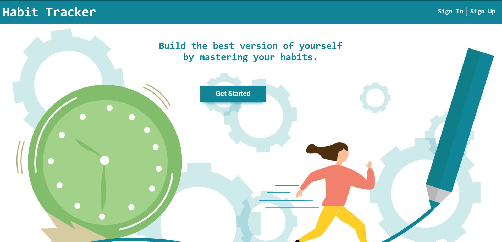

# HabitTracker

HabitTracker is a web application designed to help users create, update, delete, and track their habits on a daily basis. It is a user-specific app, allowing individuals to monitor their habits and mark them as done or not done. The project is built using a tech stack that includes Node.js for server-side scripting, Express for handling HTTP requests and routing, MongoDB for data storage and management, and EJS for rendering views and templates.



## Table of Contents

- [Installation](#installation)
- [Usage](#usage)
- [Screenshots](#screenshots)
- [Contributing](#contributing)

## Installation

To run this application on your local machine, follow these steps:

1. Clone this repository using the following command:
   ```bash
   $ git clone https://github.com/agentgrey/TodoList.git
   ```
2. Install the required dependencies:
   ```bash
   $ npm install
   ```
3. Start the application:
   ```bash
   $ npm start
   ```
4. Open the application in your web browser by visiting:
   ```bash
   $ http://localhost:8000
   ```

## Usage

Once the application is running, follow these steps to make the most of it:

- Sign-up/Sign-in to your account.
- Click on the "Add Habit" button to create a new habit.
- Enter the name of the habit you want to track.
- Click on the "Save" button to save the habit.
- To mark a habit as complete/incomplete for the day, click on the corresponding icon.
- To delete a habit, click on the "Delete" icon next to it.
- To view today's habits, click on the "Show Daily" button.
- To edit a habit, click on the "Edit" icon next to it.

## Screenshots

### Sign-up Page


### Sign-in Page


### Weekly View Page


## Contributing

Contributions are always welcome! If you have any suggestions for improving this application, please feel free to create a pull request or open an issue.
